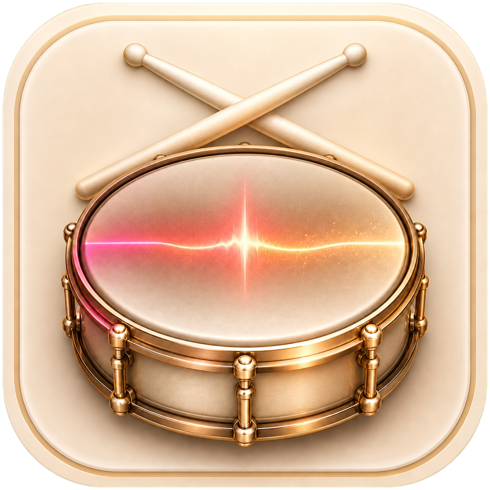
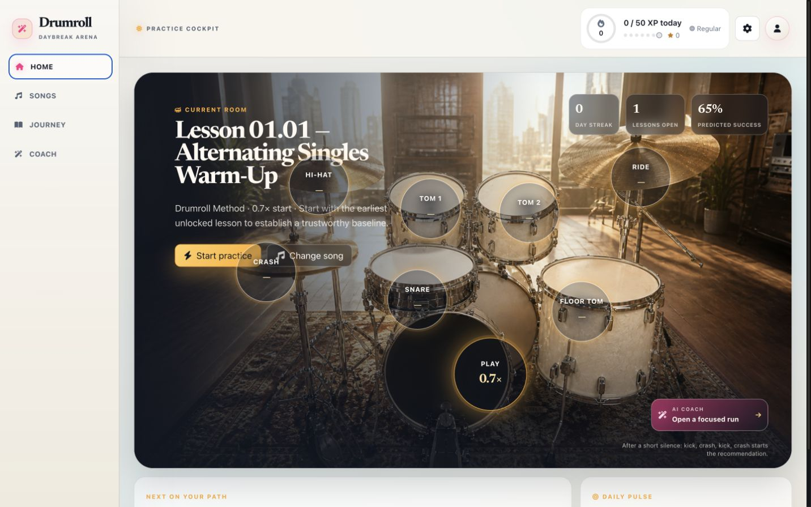

#  Drumroll

_formerly SightKick, forked from [tonygoldcrest/sightkick](https://github.com/tonygoldcrest/sightkick)_

An adaptive drum tutor and performance game for MIDI kits. Sit down, signal that you are ready from the kit, and Drumroll chooses the next useful challenge, scores every hit, focuses weak bars, adjusts tempo, and keeps the session moving without sending you back to the computer.

<h1 align="center">
  <a href="https://drumroll.pages.dev">Website</a> |
  <a href="https://github.com/Baltsat/sightkick/releases">Download</a> |
  <a href="https://discord.gg/kwBx9VZt3">Discord</a>
</h1>



## Requirements

- The current verified preview targets **Apple Silicon macOS**. The upstream
  Windows and Linux package targets remain in the source tree but are not part
  of this verified prerelease.
- Optional drum-track separation needs the [stem splitter tool](https://github.com/tonygoldcrest/sightkick-tools) (~130 MB, one-time download from within the app; Apple Silicon and Windows only).

## Features

- **Sheet music rendering**: drum charts from Clone Hero `.mid`/`.chart` files are rendered as standard notation in real time
- **Thousands of songs**: browse and download from the Enchor community library directly inside the app
- **MIDI e-kit support**: connect your electronic drum kit and get real-time hit detection scored against the chart, with a star rating at the end of each song
- **Autonomous practice**: checkpoints, lives, adaptive rewinds, tempo recovery, and automatic continuation keep a focused session moving
- **Practice and Perform**: deliberate recovery in Practice; uninterrupted, honest scoring in Perform
- **Kit controls**: deliberate four-hit gestures start, pause, retry, continue, or end a run without touching the Mac
- **170-lesson journey**: fundamentals, rudiments, coordination, reading, grooves, fills, and musical application
- **Evidence-led coach**: weak bars, timing bias, wrong-pad patterns, per-drum mastery, history, and explainable next-session recommendations
- **Flow and Classic notation**: a glowing continuous play line or a familiar page layout, with stable color-coded drum lanes
- **Stem mixer**: mute the recorded drums and hear your own playing; adjust levels per stem
- **Stem splitting**: separate a mixed recording into individual tracks automatically (macOS Apple Silicon and Windows; ~130 MB one-time download)
- **Scrolling playhead**: three modes: Cursor (follows note by note), Measure (highlights the current bar), or None
- **Color-coded notation**: each drum and cymbal maps to a distinct color; filled noteheads for drums, × for cymbals
- **Multiple difficulties**: switch between chart difficulties from the side menu
- **Favorites and search**: local library search plus online search with one-click download

## For developers

Drumroll is an Electron + React 19 desktop app. Drum charts are parsed from Clone Hero `.mid`/`.chart` files and rendered as sheet music with VexFlow; the UI uses Tailwind CSS v4 and Ant Design v6.

Requires [Node.js](https://nodejs.org/) and [Yarn](https://yarnpkg.com/) v4 (Berry). This project uses `yarn` exclusively (don't use `npm`).

```bash
yarn install        # install dependencies
yarn start          # run in dev mode (Electron + hot reload)
yarn build          # compile main, preload, and renderer
yarn lint           # ESLint verification
yarn test           # Vitest
yarn storybook      # component stories on :6006
yarn package        # build a macOS app (yarn package:win / package:linux)
```

## Acknowledgements

- [Enchor](https://www.enchor.us/) for the song library
- TheNathannator for the [GH/RB specification](https://github.com/TheNathannator/GuitarGame_ChartFormats)

## License

[MIT](LICENSE) © Anton Korolkov
