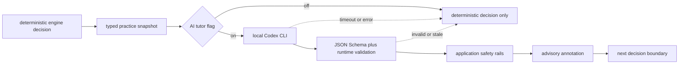

# AI tutor advisory loop

status: feature-flagged spike, off by default

## product decision

Drumroll should let a capable language model judge a typed practice snapshot and propose the next teaching move. The model owns semantic judgment; the application owns execution, hard bounds, and terminal behavior.

The deterministic pedagogy engine remains the default and the fallback. The first LLM path produces an advisory annotation attached to a deterministic chunk decision. It cannot move playback, add repetitions, or keep a session alive by itself.



This boundary survives stronger models: the model receives richer evidence and makes a better judgment without turning repeat caps, transport timing, or playback ownership into prompt folklore.

## typed practice state in

`AiTutorPracticeState` is a curated snapshot, not a raw event dump. It has five required evidence groups.

| group                  | fields                                                                                                                                                                                                                     | purpose                                                                                                           |
| ---------------------- | -------------------------------------------------------------------------------------------------------------------------------------------------------------------------------------------------------------------------- | ----------------------------------------------------------------------------------------------------------------- |
| identity and version   | `policy_version`, `request_id`, `captured_at`                                                                                                                                                                              | rejects stale responses and makes receipts replayable                                                             |
| profile                | atomic skill stage, readiness, evidence confidence, supported BPM, explicit song preference, feedback preference                                                                                                           | tells the model what is known, how well it is known, and what musical goal currently matters                      |
| current chunk plan     | item and chart revision, deterministic decision id, cue and reason, current window and phrase bounds in measures and ticks, musically valid growth windows, chunk stage/index, tempo, repeat count and cap, terminal state | gives the model the actual teaching unit while preserving the deterministic decision as the anchor                |
| last attempts          | exact windows and speeds, accuracy, coverage, timing spread, misses, wrong hits, and unambiguous wrong-pad pairs                                                                                                           | lets the model compare attempts rather than react to one score                                                    |
| ZPD and session bounds | predicted-success state and band, tempo bounds, hard prerequisites, active scaffold, intent, dose, remaining time, allowed actions                                                                                         | exposes the deterministic estimate and the application envelope without forcing the model to copy a score formula |

The spike deliberately avoids sending a learner name, account id, free-form diary, raw MIDI stream, or physical-technique claim. Chart titles, cues, and other string values are data. The prompt tells Codex never to interpret payload strings as instructions.

The application should build this snapshot at a stable boundary: after a completed phrase, after a chunk attempt, or while precomputing the next session block. It should not call a model for each hit.

## structured decision out

The model returns one `AiTutorDecision`:

```ts
type AiTutorNextAction =
  | 'repeat_window'
  | 'change_window'
  | 'change_tempo'
  | 'advance_chunk'
  | 'return_to_song'
  | 'end_session';

interface AiTutorDecision {
  next_action: AiTutorNextAction;
  window: {
    start_measure: number;
    end_measure: number;
    start_tick: number;
    end_tick: number;
  };
  tempo: {
    playback_speed: number;
    target_bpm: number | null;
  };
  encouragement_line: string;
  rationale: string;
}
```

The output stays small on purpose. Window and tempo describe the concrete move. Measure fields keep logs readable; ticks preserve lane J’s sub-bar strong-onset and tuplet-safe boundaries. The encouragement line is player-facing copy. The rationale is evidence-facing copy for a receipt, debugging, and later evaluation; it is not shown as an unquestioned fact.

Codex receives the same JSON Schema that the application exports. The CLI constrains the final response with `--output-schema`; Drumroll then parses and validates the saved JSON again. Official OpenAI documentation describes `codex exec` as the scripted, non-interactive path and documents both `--output-schema` and `--output-last-message`: [OpenAI, “Non-interactive mode”](https://developers.openai.com/codex/noninteractive) and [OpenAI, “Developer commands”](https://developers.openai.com/codex/cli/reference).

## transport

The main-process spike resolves an absolute Codex binary and invokes:

```text
/bin/bash -c '<absolute-codex> exec \
  --skip-git-repo-check \
  --sandbox read-only \
  --ephemeral \
  --ignore-user-config \
  --color never \
  --output-schema <temporary-schema> \
  --output-last-message <temporary-response> \
  <prompt> </dev/null'
```

The `/bin/bash -c` wrapper and explicit `</dev/null` are required. A non-interactive `codex exec` can otherwise wait for additional stdin. Every argument is shell-quoted, the Codex path must be absolute, and the working directory is a fresh temporary directory outside the repository. Git environment overrides are removed, the model sandbox is read-only, the session is ephemeral, and user config is ignored while saved CLI authentication remains available. No model is pinned, so this path inherits the installed CLI’s current default rather than baking today’s model into Drumroll.

The transport logs a local structured request event and either a structured response or failure event. A receipt contains the request id, timestamps, measured latency, transport name, and validated decision. Temporary schema and response files are removed after every outcome.

## feature flag and integration seam

`DEFAULT_AI_TUTOR_FEATURE_FLAGS.enabled` is `false`. With the default flags, `request_ai_tutor_advisory` returns `disabled` without touching the transport or the consumer callback.

An enabled caller supplies an `AiTutorTransport` and an optional `consume_advisory` callback. A successful result is an `AiTutorAdvisoryAnnotation` containing:

- the model decision;
- the post-rail decision;
- every application safety adjustment;
- the deterministic decision id it annotates;
- request identity, latency, receive time, and transport.

This is the lane J integration point. Its chunk trainer can map `TutorChunkGrowthState.plan.windows` into `current_chunk_plan.available_windows`, retaining the exact measure and tick boundaries, stage, label, and active index. It can then start `request_ai_tutor_advisory` without awaiting it on the playback path and attach the callback result to the next still-current decision receipt. No tutor reducer import or shared-file edit is required for this spike.

## latency and fallback

The deterministic decision is computed first and remains immediately usable. The LLM request runs outside the audio and hit-judgment path.

| condition                                                    | application behavior                                                                  |
| ------------------------------------------------------------ | ------------------------------------------------------------------------------------- |
| flag off                                                     | do not start a process; use the deterministic result                                  |
| no transport                                                 | return `fallback/unavailable`; use the deterministic result                           |
| advisory deadline exceeded                                   | abort the request, return `fallback/timeout`, and keep the deterministic result       |
| CLI error, missing auth, or malformed JSON                   | log the failure, return `fallback/transport_error`, and keep the deterministic result |
| response request id differs from the current snapshot        | return `fallback/stale_response`; never attach it to a newer plan                     |
| validated response arrives before the next relevant boundary | enforce application rails, then attach it as advisory evidence                        |

The service advisory deadline starts at 8 seconds. The transport has a 60-second resource timeout. The final recorded spike call took 13.180 seconds, which proves why the deterministic engine cannot wait for it; today that response is useful for prefetch, inspection, and offline comparison, while the active boundary falls back. These are rollout parameters, not claims about an ideal teaching interval.

## safety after model judgment

The application runs `enforce_ai_tutor_safety` after schema and runtime validation.

| rail               | enforced behavior                                                                                                                                            |
| ------------------ | ------------------------------------------------------------------------------------------------------------------------------------------------------------ |
| terminal state     | a completed/stopped chunk or exhausted session forces `end_session`                                                                                          |
| bounded repeats    | a repeat-like action at the application cap forces `return_to_song`, or `end_session` when return is unavailable                                             |
| allowed actions    | an action outside the current plan is replaced with the safe terminal route                                                                                  |
| window             | start/end ticks must match one of the chunk trainer’s musically valid windows; the application restores its canonical measure/tick boundary when they do not |
| tempo              | playback speed and BPM are clamped to the supplied ZPD envelope                                                                                              |
| playback ownership | only deterministic application code may apply the final safe decision                                                                                        |

The original model decision remains in the annotation beside the safe decision. This permits evaluation without hiding an unsafe or out-of-bounds proposal.

MIDI evidence cannot establish grip, posture, tension, pain, sticking on one same-lane pad, or acoustic tone. The prompt states this boundary, the input contains evidence confidence, and any future player-facing consumer must keep uncertain language uncertain.

## evaluation before authority

The advisory should remain non-authoritative until replay and live sessions answer five questions:

1. does the proposal improve the next attempt, delayed retention, or transfer compared with the deterministic choice?
2. does it reduce manual overrides without increasing repeated-loop traps or early exits?
3. how often do schema validation, stale-response checks, tempo/window clamps, or repeat caps alter the model output?
4. is enough advice ready before a useful decision boundary to justify live use?
5. does the rationale preserve field semantics, especially the distinction between observed attempt accuracy and predicted-success bands?

Store paired deterministic and LLM decisions under the same request id. Compare observable outcomes, not prose quality. Promotion can start with one reversible privilege, such as choosing among already-safe candidate windows. Repeat limits, terminal states, chart-revision checks, and the deterministic fallback remain application code.
