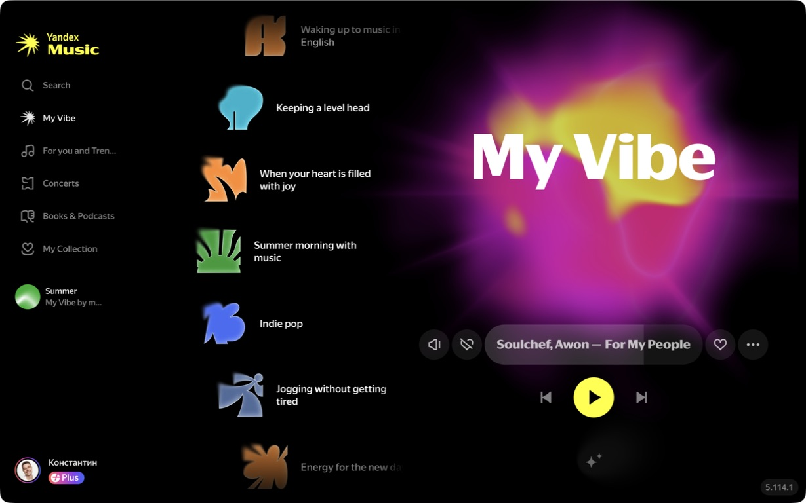
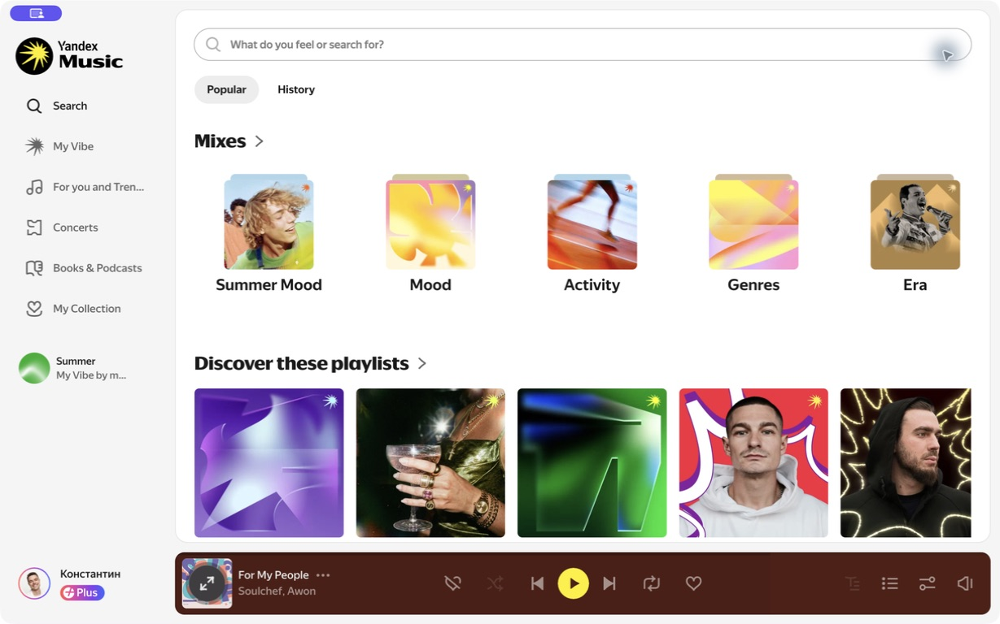
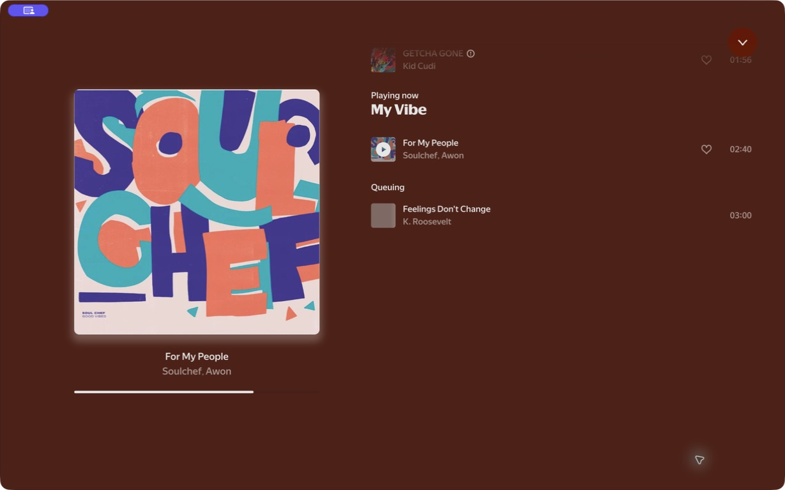
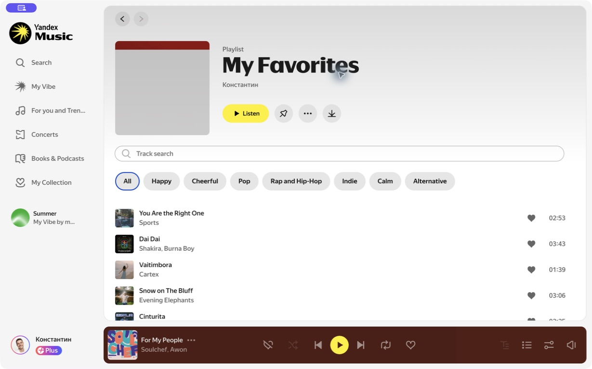

# yandex music desktop reference — 2026-08-12

source: the installed, signed-in **Yandex Music** desktop app on this Mac, version `5.114.1`, observed on 2026-08-12. The source surface was restored to its original `My Vibe` route after capture. No playback, volume, account, library, or preference state was changed.

These are private product-reference captures. They document hierarchy and interaction grammar; they are not a request to reproduce Yandex Music's visual assets or UI wholesale.

## key frames

| `My Vibe`                                                                                               | search and collection                                                                                          |
| ------------------------------------------------------------------------------------------------------- | -------------------------------------------------------------------------------------------------------------- |
|          |                 |
| now-playing and queue                                                                                   | library and playlist                                                                                           |
|  |  |

| capture                                                              | route / state         | what it makes checkable                                                                               |
| -------------------------------------------------------------------- | --------------------- | ----------------------------------------------------------------------------------------------------- |
| [00-initial-home.png](00-initial-home.png)                           | `My Vibe` on entry    | black art-led home, left rail, vertical personal-choice column, one huge title, persistent player     |
| [01-search-empty.png](01-search-empty.png)                           | search focus          | search owns the route; the player and rail remain visible                                             |
| [01-search-popular.png](01-search-popular.png)                       | loaded search         | soft-white continuous canvas, active nav capsule, real filter chips, horizontal content rhythm        |
| [02-now-playing.png](02-now-playing.png)                             | full now-playing      | album art sets the field colour; title and progress sit in a single clear reading order               |
| [03-for-you-and-trends.png](03-for-you-and-trends.png)               | discovery loading     | route-level skeleton transition without moving the rail or player                                     |
| [03-for-you-and-trends-loaded.png](03-for-you-and-trends-loaded.png) | discovery loaded      | one title, two quiet tabs, a small personal shelf, then the content feed                              |
| [04-library.png](04-library.png)                                     | library loading       | loading state preserves the same page geometry                                                        |
| [04-library-loaded.png](04-library-loaded.png)                       | library               | sparse list rows, artwork as metadata, dense information with little visual chrome                    |
| [05-playlists.png](05-playlists.png)                                 | playlists             | the create affordance is a single empty square rather than a dense toolbar                            |
| [06-favorites-playlist.png](06-favorites-playlist.png)               | playlist              | dominant playlist identity, one yellow listen control, chips only for real filtering, flat track rows |
| [06-favorites-playlist-loaded.png](06-favorites-playlist-loaded.png) | playlist loaded       | stable route geometry after content resolves                                                          |
| [07-playback-queue.png](07-playback-queue.png)                       | player queue          | secondary information expands from the player into one full-surface reading mode                      |
| [08-my-vibe-restored.png](08-my-vibe-restored.png)                   | restored source state | exit proof: `My Vibe` is the final route, with the same paused track and mute state shown at entry    |

## observed system, not a vibe claim

- the app has two deliberate materials: an almost-black art field for `My Vibe` and now-playing, then a soft-white paper field for search, library, playlists, and discovery. It does **not** use one literal dark field across every route.
- depth comes mainly from colour fields, image scale, whitespace, hairlines, and the persistent player. Most content is arranged directly on the page, rather than inside stacks of floating cards.
- every screen spends emphasis once: `My Vibe`, the search query, the playlist title, or the active album artwork. The rest gives that one element room.
- the left rail and player bar are persistent anchors. A route can change its content without making the user rebuild spatial context.
- selected navigation and filters use a compact fill, outline, or colour change. Play/listen is the saturated action. Secondary controls stay as quiet circles or text until needed.
- the loading captures show stable geometry first, then content fills it. This reduces the feeling of the app rearranging itself during navigation.

## interaction capture limits

The desktop accessibility interface exposes the latent per-row play, pin, like, and context controls, and the captures record selected/active states. Its Computer Use API has no pointer-move primitive, so a literal hover frame and millisecond animation timing were not synthesized. Treat the hover and motion values in [`../../visual-system-v3.md`](../../visual-system-v3.md) as the Drumroll policy to verify in a later rendered-app QA pass, not as unmeasured claims about Yandex Music internals.
