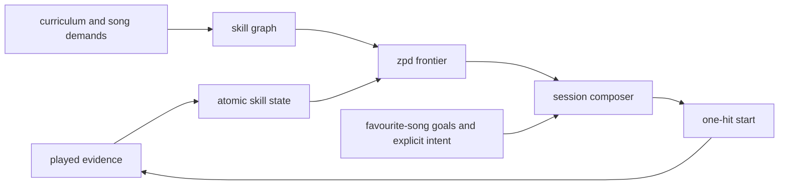
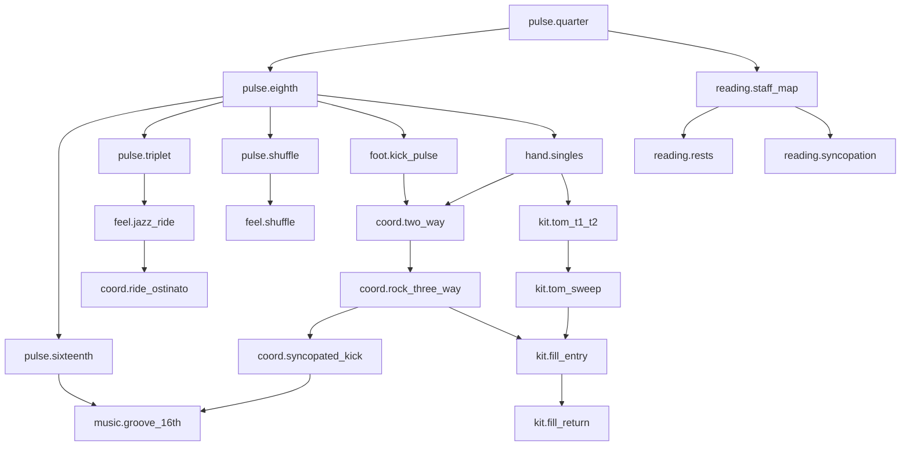

# Drumroll pedagogy engine v2

status: implementation specification
scope: the learner model and session selector for a Yamaha DTX402 learner who wants real, durable drumming ability by 2026-09-10
non-goal: a cosmetic gamification layer, a generic recommendation feed, or a claim that MIDI can assess physical technique it cannot observe

## the product decision

Drumroll should run one educational loop:



The first kick should launch a short, evidence-backed next action. The user can always choose a song, a lesson, or a different difficulty; the engine owns the default, not the learner’s agency.

The core distinction is between a good attempt and a learned skill. A run can earn stars and still be only acquisition evidence. A skill becomes retained after a delayed probe and transferable after it works in a different musical context. This follows the motor-learning distinction between immediate performance and retained capability, rather than treating a fresh high score as mastery ([Kantak and Winstein, 2012](https://pubmed.ncbi.nlm.nih.gov/22142953/)).

## current baseline: keep the useful machinery

The app already has more real evidence than a typical practice game.

| existing component                                                          | verified behavior                                                                                                 | v2 disposition                                                                                   |
| --------------------------------------------------------------------------- | ----------------------------------------------------------------------------------------------------------------- | ------------------------------------------------------------------------------------------------ |
| [`practice-stats`](../src/renderer/services/practice-stats/)                | persists hit, miss, wrong-pad, lane, timing-bias, speed, Tutor, Coach, and authored-skill evidence                | keep as the immutable evidence source; add atomic attribution rather than a parallel stats store |
| [`tutor`](../src/renderer/services/tutor/)                                  | detects repeat errors, wrong-pad pairs, and timing spread; runs bounded recovery loops                            | keep its in-run scaffolding; emit atomic evidence and scaffold level                             |
| [`remediation`](../src/renderer/services/remediation/)                      | persists targeted 1–4 bar loops with forgiving quality gates                                                      | keep it as a local repair tool, not the global curriculum selector                               |
| [`coach`](../src/renderer/services/coach/)                                  | finds trouble bars, transition breaks, lane weakness, speed sensitivity, and pad confusion                        | keep direct routes, then route through the skill graph instead of one fixed lesson per broad tag |
| [`learning-profile`](../src/renderer/services/learning-profile/)            | builds eight confidence-shrunk broad axes from run summaries                                                      | retain as a presentation aggregate only; do not use it as the source of truth for readiness      |
| [`next-practice`](../src/renderer/services/next-practice/)                  | ranks available candidates, uses weak evidence, speed, freshness, preference, and a simple predicted-success zone | replace its scoring core with atomic demand, retention, transfer, and a calibrated ZPD frontier  |
| [`practice-wave`](../src/renderer/services/next-practice/practice-wave.ts)  | creates a fixed focus → apply → consolidate triplet                                                               | replace with a time- and intent-aware session composer                                           |
| [`adaptive-practice`](../src/renderer/services/adaptive-practice/)          | widens or tightens the scoring window from recent evidence                                                        | keep the learner-friendly window; normalize estimator evidence by the window that judged the run |
| [`resources/lessons/curriculum.yaml`](../resources/lessons/curriculum.yaml) | has 170 authored exercises, tags, tempo ladders, cues, and a generated predecessor chain                          | promote its metadata into a validated atomic-skill manifest                                      |

### known limits that must remain explicit

MIDI can measure onset timing, expected-versus-actual pad choice, note coverage, relative velocity, speed, and repetition history. It cannot prove grip, rebound, posture, tension, stickings when both hands strike the same lane, acoustic tone, injury risk, or whether a player heard and understood a musical phrase. The existing `sk_assessment_boundary` is correct; v2 must preserve it per skill and never infer an unmeasurable physical claim from a score.

The current curriculum also documents chart-format gaps for flams, drags, buzz rolls, fermata, ride bell, repeat navigation, and first/second endings. Those become explicit `unassessable` or `unsupported` nodes, not hidden zeros in a learner profile.

## research basis and product translation

This is a practical engine, not an attempt to encode every educational theory as a score. Each rule below has a small operational consequence.

| finding                                                                                                                                                                                                                                                                                                                                                                           | engine rule                                                                                                                                                                           |
| --------------------------------------------------------------------------------------------------------------------------------------------------------------------------------------------------------------------------------------------------------------------------------------------------------------------------------------------------------------------------------- | ------------------------------------------------------------------------------------------------------------------------------------------------------------------------------------- |
| the challenge-point framework says task difficulty must be interpreted relative to the learner, because the useful information in practice depends on both skill and task difficulty ([Guadagnoli and Lee, 2004](https://pubmed.ncbi.nlm.nih.gov/15130871/))                                                                                                                      | predict success from the learner’s atom-level state and the item’s explicit demand; do not rank solely by global song difficulty or linear curriculum position                        |
| immediate practice performance can diverge from retention and transfer ([Kantak and Winstein, 2012](https://pubmed.ncbi.nlm.nih.gov/22142953/))                                                                                                                                                                                                                                   | distinguish `provisional`, `retained`, and `transferable`; a new score cannot silently graduate a prerequisite                                                                        |
| high contextual interference improves delayed transfer on average, but effect sizes are heterogeneous and task complexity matters ([Czyż, Wójcik, and Solarská, 2024](https://www.frontiersin.org/journals/psychology/articles/10.3389/fpsyg.2024.1377122/full))                                                                                                                  | acquire a new motor pattern in a short blocked loop, then interleave it with a different groove or song; do not randomize a novice into chaos                                         |
| augmented feedback can help motor learning, yet feedback form and timing matter ([Moinuddin, Goel, and Sethi, 2021](https://pmc.ncbi.nlm.nih.gov/articles/PMC8681883/)); self-controlled feedback has retention and transfer benefits ([Wang et al., 2025](https://pmc.ncbi.nlm.nih.gov/articles/PMC12467369/))                                                                   | show a single actionable cue after a phrase, make detailed replay and Coach evidence available on demand, and let the drummer request replay/slowdown rather than narrating every hit |
| distributed practice tends to beat massed practice for later retention; motor-learning evidence also supports retention probes rather than only acquisition runs ([Mawson and Kang, 2025](https://pmc.ncbi.nlm.nih.gov/articles/PMC12189222/); [Barzyk and Gruber, 2024](https://www.frontiersin.org/journals/sports-and-active-living/articles/10.3389/fspor.2024.1324615/full)) | schedule skill-specific reviews at expanding intervals and award progress for delayed retrieval, not mindless same-session grind                                                      |
| Vygotsky’s ZPD concerns the gap between independent performance and performance with scaffolding ([Vygotsky, 1978, p. 86](https://books.google.com/books/about/Mind_in_Society.html?id=RxjjUefze_oC))                                                                                                                                                                             | represent the scaffold explicitly: slower tempo, fewer bars, preview, cue, or Tutor loop; a full-speed song can be inside the ZPD only when a concrete scaffold makes it attainable   |
| sustained music practice is driven more by intrinsic motives and perceived competence than by extrinsic rewards alone ([MacIntyre, Schnare, and Ross, 2018](https://journals.sagepub.com/doi/10.1177/0305735617721637))                                                                                                                                                           | favourite songs are goals with visible causal paths; XP confirms real evidence and cannot become the reason to repeat an already-mastered item                                        |
| the PAS 40 gives a shared rudiment vocabulary and recommends open → close → open practice ([Percussive Arts Society](https://pas.org/rudiments/))                                                                                                                                                                                                                                 | model rudiments as technique families with tempo ladders and music applications, while marking hand-specific proof as unavailable on a single MIDI snare lane                         |

### product precedents worth borrowing, with the boundary

| product or field observation                                                                                                                                         | useful behavior                                                                          | Drumroll boundary                                                                                                 |
| -------------------------------------------------------------------------------------------------------------------------------------------------------------------- | ---------------------------------------------------------------------------------------- | ----------------------------------------------------------------------------------------------------------------- |
| [Melodics practice mode](https://support.melodics.com/en/articles/6777061-get-started-with-melodics)                                                                 | preview, loop points, tempo reduction, and automatic BPM increases after good loops      | keep a small tempo runway and phrase loop; use learner evidence rather than a universal pass count                |
| [Melodics weekly goals](https://support.melodics.com/en/articles/15091960-weekly-goals)                                                                              | a short curated set tied to the next checkpoint, with optional bonus XP                  | render a daily practice capsule tied to the frontier; no hard gate that blocks free play                          |
| [Drumeo’s method](https://www.drumeo.com/)                                                                                                                           | structured path plus songs and an explicit answer to what to practise                    | keep the path, but diagnose from the DTX evidence instead of asking the learner to self-diagnose every time       |
| [Yousician’s level choice](https://support.yousician.com/hc/en-us/articles/204793951-Can-my-students-start-practice-at-different-levels)                             | learner can step difficulty down or up when the path feels wrong                         | expose a one-tap “easier” and “harder” correction; feed it into calibration rather than treating it as failure    |
| [Duolingo’s current teaching-method description](https://blog.duolingo.com/duolingo-teaching-method/)                                                                | adapts order and challenge, then uses small habit mechanics                              | use streaks and XP only after the engine has shown the musical skill or review they reinforce                     |
| Clone Hero community practice reports, such as [this speed-ladder discussion](https://www.reddit.com/r/CloneHero/comments/1uyzy95/how_to_get_from_expert_to_master/) | players naturally slow a hard section, raise speed, and then transfer back to full songs | retain the joy of a song library and visible difficulty, but score real drumming and make the skill path explicit |

The Clone Hero source is field observation, not experimental evidence. It confirms the expected player behavior; it does not set the teaching policy.

## canonical skill graph

### design rules

1. a node is a learnable, observable musical capability, not a vague topic such as “better drumming.”
2. an edge means a prerequisite for independent execution, not a forced curriculum order.
3. an edge never blocks free play. It only changes the engine’s recommended scaffold and its confidence in a claimed goal.
4. a node states its evidence boundary. For example, `hand.double_stroke` can be taught and cued but is `partially_observable` on a DTX402 because the same snare lane does not reveal which hand struck it.
5. every curriculum exercise, chart phrase, Coach finding, and favourite-song goal is mapped through the same node IDs.

### node families

| family              | atomic nodes                                                                                                                                                                                                         | main evidence                                                                                                 |
| ------------------- | -------------------------------------------------------------------------------------------------------------------------------------------------------------------------------------------------------------------- | ------------------------------------------------------------------------------------------------------------- |
| pulse and meter     | `pulse.quarter`, `pulse.eighth`, `pulse.sixteenth`, `pulse.triplet`, `pulse.shuffle`, `meter.3_4`, `meter.6_8`, `meter.12_8`, `meter.cut_time`                                                                       | timing distribution, coverage, meter-specific transfer                                                        |
| rhythm reading      | `reading.staff_map`, `reading.rests`, `reading.ties`, `reading.syncopation`, `reading.subdivision_switch`, `reading.form_navigation`                                                                                 | first-pass accuracy on unseen or delayed phrases; `form_navigation` stays unsupported until chart jumps exist |
| hand vocabulary     | `hand.singles`, `hand.doubles`, `hand.triples`, `hand.paradiddle_single`, `hand.paradiddle_double`, `hand.paradiddle_triple`, `hand.paradiddle_diddle`, `hand.accent_control`, `hand.ghost_note`, `hand.cross_stick` | snare timing/velocity and application; stickings are partial evidence only                                    |
| foot control        | `foot.kick_pulse`, `foot.kick_offbeat`, `foot.hihat_chick`, `foot.hihat_open_close`                                                                                                                                  | kick and hi-hat lane accuracy, timing, and repeatability                                                      |
| coordination        | `coord.two_way`, `coord.rock_three_way`, `coord.syncopated_kick`, `coord.ride_ostinato`, `coord.linear`, `coord.hand_to_foot`                                                                                        | joint-lane patterns, pattern transition accuracy, transfer between items                                      |
| kit navigation      | `kit.tom_t1_t2`, `kit.tom_t2_t3`, `kit.tom_t1_t3`, `kit.tom_sweep`, `kit.fill_entry`, `kit.fill_return`, `kit.crash_phrase`                                                                                          | expected-to-actual lane transition matrix and phrase return to groove                                         |
| dynamics and feel   | `dynamics.accent`, `dynamics.ghost`, `dynamics.loud_soft`, `feel.backbeat`, `feel.pocket`, `feel.shuffle`, `feel.jazz_ride`                                                                                          | velocity only when calibrated; timing stability and contextual groove transfer otherwise                      |
| musical application | `music.groove_8th`, `music.groove_16th`, `music.fill_8th`, `music.fill_16th`, `music.song_form`, `music.capstone`                                                                                                    | full-phrase coverage, timekeeping through fills, songs and etudes                                             |

The node count can grow, but v2 starts with these stable families rather than reflecting every YAML tag one-for-one. A tag such as `sixteenth-notes` is a curriculum label; it maps to `pulse.sixteenth`, and possibly a hand, foot, or coordination node based on the concrete exercise demand.

### dependency edges



Edges use three strengths:

| edge strength | meaning                                    | selector effect                                                     |
| ------------- | ------------------------------------------ | ------------------------------------------------------------------- |
| `hard`        | no independent execution claim without it  | recommend a scaffold or prerequisite task first                     |
| `supporting`  | likely helps but does not block the target | reduce confidence and surface a smaller review only when it is weak |
| `transfer`    | tests whether the prerequisite generalizes | offers an interleaved or musical probe after acquisition            |

Examples: `pulse.eighth → coord.rock_three_way` is hard; `hand.accent_control → music.fill_16th` is supporting; `kit.tom_sweep → music.fill_16th` is transfer.

### graph data contract

```ts
type EvidenceBoundary = 'midi' | 'partial_midi' | 'self_report' | 'unsupported';
type EdgeStrength = 'hard' | 'supporting' | 'transfer';

interface SkillNode {
  id: string;
  label: string;
  family: string;
  evidence_boundary: EvidenceBoundary;
  prerequisites: Array<{ id: string; strength: EdgeStrength }>;
  default_review_days: number[];
}

interface SkillDemand {
  skill_id: string;
  weight: number;
  target_bpm?: number;
  context: string;
}

interface ItemSkillManifest {
  item_id: string;
  source: 'curriculum' | 'chart_analysis' | 'manual_song_review';
  source_revision: string;
  demands: SkillDemand[];
  context_signature: string;
  assessment_confidence: number;
}
```

`context_signature` must encode musical context, not only title: meter, subdivision, active lanes, simultaneous-limb pattern, density, transition type, and whether the phrase is a groove, fill, or song section. It is how the engine distinguishes a retention pass from a transfer pass.

## mapping the 170-exercise curriculum

The source curriculum already has every exercise tagged, tempo-laddered, and generated into `song.ini`. Its 25 lesson groups form this v2 bridge. The engine must generate one `ItemSkillManifest` per exercise at package time and validate that all 170 have at least one atomic demand.

| unit                       | lesson IDs     | exercises | v2 primary node families                                                                             |
| -------------------------- | -------------- | --------: | ---------------------------------------------------------------------------------------------------- |
| foundations                | `01.01–01.03`  |         3 | `hand.singles`, `hand.doubles`, `foot.kick_pulse`, `pulse.sixteenth`                                 |
| foundations                | `02.01–02.03`  |         3 | `reading.staff_map`, `reading.rests`, `coord.two_way`                                                |
| rudiment gym i             | `03.01–03.10`  |        10 | `hand.singles`, `hand.doubles`, `hand.triples`, `pulse.sixteenth`, `kit.fill_entry`                  |
| rudiment gym i             | `04.01–04.07`  |         7 | `hand.triples`, `hand.accent_control`, `pulse.triplet`, `kit.fill_entry`                             |
| first grooves              | `05.01–05.05`  |         5 | `coord.two_way`, `coord.rock_three_way`, `feel.backbeat`, `music.groove_8th`                         |
| first grooves              | `06.01–06.07`  |         7 | `hand.paradiddle_single`, `coord.syncopated_kick`, `coord.hand_to_foot`, `music.groove_8th`          |
| toms, dynamics, fills i    | `07.01–07.08`  |         8 | `dynamics.loud_soft`, `kit.tom_t1_t2`, `kit.tom_t2_t3`, `kit.tom_sweep`, `kit.fill_return`           |
| toms, dynamics, fills i    | `08.01–08.06`  |         6 | `reading.ties`, `reading.rests`, `coord.syncopated_kick`, `dynamics.accent`, `meter.3_4`             |
| toms, dynamics, fills i    | `09.01–09.06`  |         6 | `hand.accent_control`, `dynamics.ghost`, `hand.cross_stick`, `feel.pocket`, `music.fill_8th`         |
| toms, dynamics, fills i    | `10.01–10.10`  |        10 | `dynamics.accent`, `kit.fill_entry`, `kit.fill_return`, `foot.hihat_open_close`, `music.fill_8th`    |
| groove vocabulary and form | `11.01–11.08`  |         8 | `reading.syncopation`, `feel.backbeat`, `music.groove_8th`, `music.fill_8th`                         |
| groove vocabulary and form | `12.01–12.02`  |         2 | `music.song_form`, `music.capstone`                                                                  |
| rudiment gym ii            | `13.01–13.08`  |         8 | `hand.paradiddle_single`, `hand.paradiddle_double`, `coord.hand_to_foot`, `music.fill_16th`          |
| rudiment gym ii            | `14.01–14.08`  |         8 | `hand.paradiddle_triple`, `hand.paradiddle_diddle`, `hand.accent_control`, `music.fill_16th`         |
| rudiment gym ii            | `15.01–15.03`  |         3 | `coord.hand_to_foot`, `coord.linear`, `music.groove_16th`                                            |
| 16th-note mastery          | `16.01–16.10`  |        10 | `pulse.sixteenth`, `coord.syncopated_kick`, `feel.backbeat`, `music.groove_16th`                     |
| 16th-note mastery          | `17.01–17.05`  |         5 | `reading.subdivision_switch`, `reading.syncopation`, `music.groove_16th`                             |
| 16th-note mastery          | `18.01–18.07`  |         7 | `kit.tom_sweep`, `kit.fill_entry`, `kit.fill_return`, `music.fill_16th`                              |
| triplets, jazz, shuffle    | `19.01–19.09`  |         9 | `pulse.triplet`, `feel.jazz_ride`, `coord.ride_ostinato`, `music.song_form`                          |
| triplets, jazz, shuffle    | `20.01–20.07`  |         7 | `hand.accent_control`, `pulse.triplet`, `feel.jazz_ride`, `music.fill_8th`                           |
| triplets, jazz, shuffle    | `21.01–21.12`  |        12 | `pulse.shuffle`, `feel.shuffle`, `foot.hihat_chick`, `meter.3_4`                                     |
| rudiment gym iii           | `22.01–22.08`  |         8 | `hand.doubles`, `hand.accent_control`, `music.fill_16th`                                             |
| rudiment gym iii           | `23.01–23.08`  |         8 | `hand.doubles`, `hand.accent_control`, `music.fill_16th`                                             |
| new meters and capstones   | `24.01–24.08`  |         8 | `meter.6_8`, `meter.12_8`, `meter.cut_time`, `feel.shuffle`, `music.groove_8th`                      |
| new meters and capstones   | `25.01–25.02`  |         2 | `music.song_form`, `music.capstone`, transfer probes                                                 |
| total                      | all rows above |       170 | every node has at least one acquisition item and, where MIDI can observe it, one later transfer item |

### examples of item-level attribution

| current exercise                        | existing tags                                                             | required v2 atomic demands                                                                              |
| --------------------------------------- | ------------------------------------------------------------------------- | ------------------------------------------------------------------------------------------------------- |
| `01.01` alternating singles warm-up     | `sixteenth-notes`, `timing`                                               | `hand.singles` 0.55, `pulse.sixteenth` 0.45                                                             |
| `05.03` first rock beat                 | `accents`, `hihat-timekeeping`, `kick-independence`, `sixteenth-notes`    | `pulse.eighth` 0.20, `foot.kick_pulse` 0.20, `coord.rock_three_way` 0.35, `feel.backbeat` 0.25          |
| `07.05` random-order three-tom callouts | `eighth-notes`, `toms`                                                    | `kit.tom_t1_t2` 0.25, `kit.tom_t2_t3` 0.30, `kit.tom_t1_t3` 0.25, `kit.tom_sweep` 0.20                  |
| `13.04` single paradiddle groove        | `paradiddle`, `single-paradiddle`, `linear-drumming`, `kick-independence` | `hand.paradiddle_single` 0.40, `coord.linear` 0.25, `coord.hand_to_foot` 0.20, `music.groove_16th` 0.15 |
| `19.06` basic jazz ride pattern         | `jazz-ride`, `triplet-feel`                                               | `pulse.triplet` 0.35, `feel.jazz_ride` 0.35, `coord.ride_ostinato` 0.30                                 |
| `24.05` half-time 6/8 groove            | `compound-meter`, `kick-independence`, `new-meter`                        | `meter.6_8` 0.40, `pulse.triplet` 0.20, `coord.rock_three_way` 0.25, `feel.backbeat` 0.15               |

The full machine-readable list belongs in a generated manifest, not a 170-row prose table. The validation test must fail if a curriculum edit leaves an exercise unmapped, creates an unknown node, introduces a graph cycle, or claims `midi` evidence for an `unsupported` skill.

## song requirements and favourite-song paths

Songs need the same manifest as lessons. Their demands are not copied from difficulty labels, because an “expert” chart can be trivial in one skill and impossible in another.

### song manifest construction

1. derive observable chart features: meter, subdivision, BPM, note density, lane demand, simultaneous-limb patterns, expected lane transitions, fills, groove return, section boundaries, and chart revision.
2. map those features to atomic demands with a source confidence.
3. use `chart_analysis` only for the first version; allow `manual_song_review` to correct the favourite songs that matter most.
4. never claim a requirement from an uncertain transcription lane. For example, a ride/hi-hat distinction with weak chart confidence lowers `assessment_confidence` and cannot create a hard prerequisite.

```ts
interface SongGoal {
  song_id: string;
  preferred: boolean;
  target_section?: { start_bar: number; end_bar: number };
  goal_kind: 'first_playable_pass' | 'full_song' | 'performance_ready';
}

interface UnlockPath {
  goal: SongGoal;
  blockers: Array<{ skill_id: string; current: number; target: number }>;
  next_items: Array<{ item_id: string; reason: string }>;
  next_song_probe?: {
    song_id: string;
    start_bar: number;
    end_bar: number;
    speed: number;
  };
}
```

“unlock” means “the engine can credibly make a first playable pass likely.” It never hides the song. A favourite can always be opened in free play. The path simply answers: “this 90-second favourite-song section will become attainable after these two exercises and one transfer probe.”

The initial path finder should be a shortest path over unmet hard prerequisites, constrained by:

- items the learner can play now with predicted success inside the ZPD band;
- lessons that create the largest reduction in the song’s bottleneck demand;
- one song probe as soon as it is safe enough to be motivating;
- source confidence and chart revision;
- user preference, which can break ties but cannot make a 25% success task the default.

## learner-state estimation

### stored state

```ts
type SkillStage =
  | 'unknown'
  | 'assessed'
  | 'provisional'
  | 'retained'
  | 'transferable';

interface AtomicSkillState {
  skill_id: string;
  alpha: number;
  beta: number;
  effective_trials: number;
  best_supported_bpm?: number;
  last_acquisition_at?: string;
  last_retention_at?: string;
  last_transfer_at?: string;
  next_review_at?: string;
  stage: SkillStage;
  evidence_boundary: EvidenceBoundary;
}

interface SkillEvidenceEvent {
  run_id: string;
  chart_revision: string;
  skill_id: string;
  item_id: string;
  context_signature: string;
  evidence_kind: 'acquisition' | 'retention' | 'transfer';
  quality: number;
  weight: number;
  playback_speed: number;
  completed_at: string;
}
```

Keep raw `StoredPracticeRun` records where they already live. Persist these compact events with their source revision so the estimator can be rebuilt and so a revised chart never retroactively changes an old claim.

### attribution and quality

For every completed run with enough scored notes:

1. obtain the item manifest for the exact chart revision.
2. calculate a quality score for each demanded atomic skill.
3. do not create evidence when note coverage is too low, the source chart confidence is too low, or the skill boundary is unsupported.
4. attach the score to `acquisition`, `retention`, or `transfer` based on time and `context_signature`.

For v2’s deterministic first version:

```text
quality = 0.55 × accurate_coverage
        + 0.20 × timing_stability
        + 0.15 × correct_lane_rate
        + 0.10 × phrase_completion

event_weight = demand_weight
             × min(1, scored_notes / 12)
             × assessment_confidence
             × source_reliability

alpha += event_weight × quality
beta  += event_weight × (1 - quality)
p_hat = alpha / (alpha + beta)
```

`timing_stability` uses timing error relative to the scoring window stored on the run. Wider adaptive windows keep a developing learner in the game; they must not make the same raw timing error look more skilled than it was. Store both normalized and raw timing terms for later calibration.

Start each skill at `alpha = beta = 1.5`, then decay evidence gently toward that prior when estimating an overdue skill:

```text
decayed_alpha = 1.5 + (alpha - 1.5) × 2^(-days_since_evidence / half_life_days)
decayed_beta  = 1.5 + (beta - 1.5) × 2^(-days_since_evidence / half_life_days)
```

Use a 21-day initial half-life for provisional skills and a 35-day half-life after retained evidence. Those are tunable starting policies, not claims about a biological constant. The engine must log the policy version on each decision.

### stages and promotion rules

| stage          | minimum proof                                                       | effect                                                                           |
| -------------- | ------------------------------------------------------------------- | -------------------------------------------------------------------------------- |
| `unknown`      | no usable observation                                               | schedule a short diagnostic only when the missing skill blocks a meaningful goal |
| `assessed`     | one covered attempt                                                 | can estimate a scaffold; cannot unlock a dependent independent-execution claim   |
| `provisional`  | two quality attempts in one context, at or near the target scaffold | can advance to a related lesson but schedules a delayed probe                    |
| `retained`     | successful probe at least 24 hours after the last qualifying pass   | satisfies hard prerequisite edges for independent recommendation                 |
| `transferable` | successful retained probe in a different `context_signature`        | earns confidence for songs, fills, and variation rather than one memorized chart |

Use a lower confidence bound, rather than the posterior mean alone, for `retained` and `transferable` promotion. Sparse evidence should produce “we are checking this” instead of a fake exact percentage.

### tempo model

Skill state needs a tempo frontier, not only a unitless score. For each atomic skill, retain the highest BPM or playback speed with covered quality ≥0.82 across two contexts. A proposed tempo is a stretch when it is one controlled step above that frontier; it is a consolidation task when it is at or below it.

The existing lesson tempo ladders are an excellent source for this. The system should prefer a authored 60 → 80 → 100 → 120 BPM ladder to arbitrary playback-speed bumps where a ladder exists. For songs, use playback speed and keep its relationship to the chart’s source BPM in the manifest.

## ZPD frontier computation

ZPD in Drumroll is an operational scheduling category, not a claim to read the learner’s mind.

For candidate `c`, calculate:

```text
skill_fit      = weighted_harmonic_mean(p_hat for c.demands)
prereq_fit     = minimum(lower_confidence_bound for hard prerequisites)
tempo_fit      = similarity(candidate_bpm, best_supported_bpm)
transfer_fit   = evidence from related context signatures
uncertainty    = 1 - confidence_from_effective_trials

predicted_success(c) = clamp(
  0.05,
  0.95,
  0.45 × skill_fit
  + 0.20 × prereq_fit
  + 0.15 × tempo_fit
  + 0.10 × transfer_fit
  + 0.10 × uncertainty_safe_default
)
```

The harmonic mean keeps a weak bottleneck visible. A drummer with strong hand control and poor kick coordination should not receive an easy-looking average that launches an impossible groove.

| candidate state          |                          predicted success | engine action                                                                                     |
| ------------------------ | -----------------------------------------: | ------------------------------------------------------------------------------------------------- |
| assessment               | no useful evidence or uncertainty too high | run a 30–60 second diagnostic phrase, then recompute                                              |
| too easy                 |                                      >0.90 | use for a retention probe, warm-up, or confidence restoration; do not make it the main work block |
| productive acquisition   |                                  0.68–0.82 | preferred new-skill target with a stated scaffold                                                 |
| productive consolidation |                                  0.78–0.90 | preferred for a familiar skill, tempo progression, or song application                            |
| scaffold first           |                                  0.45–0.67 | reduce tempo, bars, density, or limb count; do not call the unmodified item ZPD                   |
| goal preview only        |                                      <0.45 | show the favourite-song destination and its next blocker; do not auto-launch it as practice       |

The current `zpdFit` gives full credit across 70–90% and accepts 45–90% as broadly productive. v2 narrows the first-exposure band, models prerequisite confidence, and makes the scaffold part of the candidate. This is the difference between “a score says it is hard enough” and “this exact next layer is close enough to learn.”

### deterministic candidate selection

```text
learning_value(c) = 0.35 × zpd_fit(c)
                  + 0.20 × bottleneck_reduction(c, active_goal)
                  + 0.15 × due_retention_value(c)
                  + 0.10 × transfer_value(c)
                  + 0.10 × preference_pull(c)
                  + 0.10 × evidence_value(c)
                  - fatigue_penalty(c)
```

Hard gates remain first: candidate exists, chart is playable, lesson prerequisites have a valid manifest, and a chart-revision mismatch cannot reuse evidence. The engine writes a `PracticeDecision` with the candidate, inputs, scores, policy version, and explanation. That makes every “why this now?” answer inspectable and testable.

## session composer

### input contract

```ts
type SessionIntent =
  | 'smart_start'
  | 'song'
  | 'exercise'
  | 'review'
  | 'free_play';
type SessionEnergy = 'short' | 'standard' | 'deep';

interface SessionRequest {
  intent: SessionIntent;
  energy: SessionEnergy;
  active_goal?: SongGoal;
  explicit_song_id?: string;
  recent_early_exits: number;
  now: string;
}

interface SessionBlock {
  role: 'orient' | 'acquire' | 'apply' | 'retain' | 'transfer' | 'celebrate';
  candidate_id: string;
  bar_range?: { start: number; end: number };
  speed: number;
  scaffold: Array<'preview' | 'slower_tempo' | 'short_loop' | 'Tutor'>;
  stop_rule: string;
  why: string;
}
```

“mood-aware” needs a narrow, honest definition. The app should not infer emotion from drumming. It should honor explicit context and low-risk behavioral signals:

- an active song/favourite selection means `song` intent;
- a recent early exit, a short-session selection, or late-session fatigue changes dose and selects a more immediately musical application;
- an explicit “exercise” or “review” choice wins;
- absent a signal, `smart_start` uses the highest learning-value capsule and starts in under one minute.

The Home screen may remember the last chosen `SessionEnergy`, but it should never ask a questionnaire before the kick. A small “song / smart / exercise” selector and a 5 / 12 / 25 minute chip are enough to correct the default.

### one-hit launch behavior

When the DTX402 is connected and the learner strikes the kick on Home:

1. if a song or favourite is explicitly active, launch its best ZPD phrase with a count-in; use the blocking skill as the next block if the phrase is not yet viable.
2. if the learner chose `exercise`, launch the top ZPD exercise directly.
3. otherwise launch `smart_start`: the shortest block that either reduces the active favourite-song blocker or satisfies the highest-value due review.
4. after a block, adjust from real evidence: increase one tempo step after two quality passes; shrink to a scaffold after two low-coverage or low-quality passes; offer stop after the planned dose.

The first MIDI hit starts the chosen plan. It does not become a graded diagnostic and it does not surprise the learner with a modal.

### block recipes

| energy                     | default recipe                                                                                                                              | intended effect                                                     |
| -------------------------- | ------------------------------------------------------------------------------------------------------------------------------------------- | ------------------------------------------------------------------- |
| short, about 5 minutes     | 45 s orient → 2 min acquisition or review → 2 min favourite-song application                                                                | preserve habit and musical payoff                                   |
| standard, about 12 minutes | 1 min orient → 4 min acquisition → 3 min interleaved application → 2 min delayed or alternate-context probe → 2 min favourite section       | acquire, then prevent chart-specific cramming                       |
| deep, about 25 minutes     | 2 min orient → 8 min two linked acquisition items → 5 min interleaved application → 5 min song section → 3 min transfer probe → 2 min recap | build a prerequisite layer and demonstrate why it matters musically |

The composer may skip a block when the evidence says it is unnecessary. It must not fabricate all six blocks for every session.

### feedback policy

- while playing: visual note feedback and one current target, such as “keep the hi-hat pulse through the kick variation.”
- after a phrase: one highest-value cue, a replay option, and an explainable speed change.
- after a session: show the exact skill state changed, the evidence class, one due review, and the nearest favourite-song payoff.
- on request: open the detailed Coach evidence, raw timing and lane data, or a bar loop.

Favor external or musical cues when possible: “make the backbeat land with the click” is better than a running stream of body-part instructions. The feedback system must respect novice uncertainty and never present a low-confidence diagnosis as fact.

## progress surfaces

| surface             | must answer                      | display                                                                                                                |
| ------------------- | -------------------------------- | ---------------------------------------------------------------------------------------------------------------------- |
| Home                | what happens if I hit the kick?  | one named next action, duration, speed, predicted band, one-line reason, and favourite-song link when present          |
| journey             | what layer is nearly ready?      | graph frontier with `secure`, `next`, `building`, and `unknown` states; evidence confidence beside each state          |
| favourite-song page | what unlocks this specific song? | section target, three blocking nodes at most, next lesson path, and a playable preview even when blocked               |
| in-session HUD      | what should I alter right now?   | one cue, loop progress, and pace; no dashboard clutter                                                                 |
| run recap           | did I learn or merely finish?    | acquisition/retention/transfer classification, evidence coverage, state delta, due review date, and an optional replay |
| profile             | am I making real progress?       | per-family retained and transferable coverage, trends, real song sections reached, and visible assessment gaps         |

XP, streaks, trophies, and stars should consume `SkillEvidenceEvent` and `PracticeDecision` outputs. They can reward a delayed retention probe or a successful transfer, but not inflate skill state from time spent, a stopped run, or repeat pressing.

## implementation map

| rank | change                                                                                       | current files to adapt                                                                                       | acceptance proof                                                                                                                                                |
| ---: | -------------------------------------------------------------------------------------------- | ------------------------------------------------------------------------------------------------------------ | --------------------------------------------------------------------------------------------------------------------------------------------------------------- |
|    1 | add the versioned atomic skill graph and manifest validator                                  | new `services/pedagogy/skill-graph.ts`; `resources/lessons/curriculum.yaml`; `resources/lessons/generate.py` | graph is acyclic; each of 170 exercises maps to ≥1 known node; every node declares an evidence boundary                                                         |
|    2 | add atomic attribution to curriculum items and chart-derived song demands                    | new `services/pedagogy/item-manifest.ts`; lesson generator; song/chart analysis boundary                     | package-time manifest has a source revision, demand weights sum to 1, and low-confidence transcription does not create hard edges                               |
|    3 | introduce a replayable atomic estimator beside the existing broad profile                    | new `services/pedagogy/skill-state.ts`; extend `practice-stats/types.ts` and persistence                     | fixed run fixture produces the same events/state; no stale chart revision is accepted; unobservable claims stay unknown                                         |
|    4 | distinguish acquisition, retention, and transfer in mastery                                  | `services/mastery/`; new `services/pedagogy/review-scheduler.ts`                                             | a same-day clean run reaches only provisional; a ≥24 h same-context probe reaches retained; different-context success reaches transferable                      |
|    5 | replace candidate-wide ZPD scoring with graph-aware predicted success and a decision receipt | `services/next-practice/recommend.ts`; new `zpd-frontier.ts`                                                 | a weak hard prerequisite blocks independent recommendation; a correct scaffold is selected; a changing candidate order cannot change an equal-evidence decision |
|    6 | replace the fixed practice wave with a time- and intent-aware session composer               | `services/next-practice/practice-wave.ts`; `views/SongListView/SongListView.tsx`; `components/HomeCockpit/`  | one kick launches a precomputed plan in each intent; short sessions end with a musical payoff; user song choice wins                                            |
|    7 | add favourite-song goal paths and chart-section probes                                       | goals components; song metadata; new `song-goals.ts` and `unlock-path.ts`                                    | a liked song exposes a non-blocking path, next exercise, and safe preview; missing chart confidence is visible                                                  |
|    8 | make Tutor and Coach emit atomic, scoped evidence instead of only broad tag routes           | `services/tutor/`; `services/coach/`; `services/remediation/`                                                | a repeated `tom2 → tom3` error updates only relevant navigation nodes and proposes the matching micro-loop                                                      |
|    9 | normalize adaptive timing-window evidence                                                    | `services/adaptive-practice/`; `practice-stats`                                                              | equal raw timing error under a wider window cannot falsely increase atomic competence; the run records the judging window                                       |
|   10 | replace broad-axis and opaque-score copy in Home, journey, recap, and Profile                | `learning-profile/`; `HomeCockpit`; `Profile`; `LessonsJourney`                                              | each surface explains the selected item, evidence confidence, and goal connection without exposing raw model jargon                                             |
|   11 | add calibration and learner-outcome evaluation before tuning coefficients                    | new fixtures and `services/pedagogy/evaluation.ts`                                                           | historical replay reports calibration, retention-probe completion, transfer success, time-to-first-song-section, and false-promotion rate                       |

### why this ordering

The first four items make the engine capable of knowing something real. Items 5–7 make it choose and communicate the right action. Items 8–11 improve diagnosis, fairness, and proof. Building a prettier Home recommendation before 1–5 would only give a weak selector better copy.

### migration discipline

1. calculate v2 state in shadow mode from existing `RunSummary` records; label all old non-atomic evidence as lower confidence instead of pretending it is granular.
2. show v1 and v2 recommendations only in an internal decision receipt until deterministic replay fixtures and calibration look sane.
3. turn v2 on for new sessions with a one-tap “choose another” escape hatch.
4. retain the current recommendation as the rollback path until v2 has enough delayed retention evidence.

No model training service, neural recommender, cloud account, or new dependency is needed for the first implementation. The durable assets are the graph, the immutable evidence events, the demand manifests, and the decision receipts.

## success criteria for the september goal

The engine cannot truthfully guarantee that a person has “fully learned drums” by a date. It can make the path measurable and maximize the odds of playing selected music with genuine retained skills.

By 2026-09-10, the learner-facing target should be a small chosen set of favourite-song sections plus a foundational capability bar:

- retained pulse and coordination skills required by those sections;
- at least one transfer probe for each core groove/fill family used in them;
- evidence of a full, uninterrupted song-section pass at target speed where the chart is trustworthy;
- explicit “unknown” labels for technique that DTX MIDI cannot verify;
- a review calendar that keeps the gained skills from evaporating after one good session.

The shortest real proof loop is: pick one favourite song section → compute its blockers → practise one near-ready skill → return to the song section → replay it tomorrow in a changed context. Every mechanic should make that loop faster, more honest, or more enjoyable.

## full sources

1. Guadagnoli, M. A., and T. D. Lee. 2004. _Challenge Point: A Framework for Conceptualizing the Effects of Various Practice Conditions in Motor Learning._ Journal of Motor Behavior 36(2): 212–224. doi: [10.3200/JMBR.36.2.212-224](https://doi.org/10.3200/JMBR.36.2.212-224). PubMed record: [PMID 15130871](https://pubmed.ncbi.nlm.nih.gov/15130871/).
2. Kantak, S. S., and C. J. Winstein. 2012. _Learning-performance distinction and memory processes for motor skills: a focused review and perspective._ Behavioural Brain Research 228(1): 219–231. doi: [10.1016/j.bbr.2011.11.028](https://doi.org/10.1016/j.bbr.2011.11.028). PubMed record: [PMID 22142953](https://pubmed.ncbi.nlm.nih.gov/22142953/).
3. Czyż, S. H., A. M. Wójcik, and P. Solarská. 2024. _The effect of contextual interference on transfer in motor learning: a systematic review and meta-analysis._ Frontiers in Psychology 15:1377122. doi: [10.3389/fpsyg.2024.1377122](https://doi.org/10.3389/fpsyg.2024.1377122). Full article: [Frontiers](https://www.frontiersin.org/journals/psychology/articles/10.3389/fpsyg.2024.1377122/full).
4. Moinuddin, A., A. Goel, and Y. Sethi. 2021. _The Role of Augmented Feedback on Motor Learning: A Systematic Review._ Cureus 13(11): e19695. doi: [10.7759/cureus.19695](https://doi.org/10.7759/cureus.19695). Full article: [PubMed Central](https://pmc.ncbi.nlm.nih.gov/articles/PMC8681883/).
5. Wang, B., T. Tao, Y. Yuan, and W. Guo. 2025. _Self-Controlled Feedback and Behavioral Outcomes in Motor Skill Learning: A Meta-Analysis._ Behavioral Sciences 15(9): 1291. doi: [10.3390/bs15091291](https://doi.org/10.3390/bs15091291). Full article: [PubMed Central](https://pmc.ncbi.nlm.nih.gov/articles/PMC12467369/).
6. Mawson, R. D., and S. H. K. Kang. 2025. _The Distributed Practice Effect on Classroom Learning: A Meta-Analytic Review of Applied Research._ Behavioral Sciences 15(6): 771. doi: [10.3390/bs15060771](https://doi.org/10.3390/bs15060771). Full article: [PubMed Central](https://pmc.ncbi.nlm.nih.gov/articles/PMC12189222/).
7. Barzyk, P., and M. Gruber. 2024. _Motor learning in golf—a systematic review._ Frontiers in Sports and Active Living 6:1324615. doi: [10.3389/fspor.2024.1324615](https://doi.org/10.3389/fspor.2024.1324615). Full article: [Frontiers](https://www.frontiersin.org/journals/sports-and-active-living/articles/10.3389/fspor.2024.1324615/full).
8. Vygotsky, L. S. 1978. _Mind in Society: The Development of Higher Psychological Processes._ Edited by M. Cole et al. Harvard University Press, p. 86. Bibliographic record and excerpt: [Google Books](https://books.google.com/books/about/Mind_in_Society.html?id=RxjjUefze_oC).
9. MacIntyre, P. D., B. Schnare, and J. Ross. 2018. _Self-determination theory and motivation for music._ Psychology of Music 46(5): 699–715. doi: [10.1177/0305735617721637](https://doi.org/10.1177/0305735617721637). Publisher page: [SAGE](https://journals.sagepub.com/doi/10.1177/0305735617721637).
10. Percussive Arts Society. _International Drum Rudiments._ Official PAS 40 reference and practice guidance. [pas.org/rudiments](https://pas.org/rudiments/).
11. Melodics. _Get started with Melodics._ Official support documentation for preview, loop practice, wait mode, and Auto BPM. [support.melodics.com](https://support.melodics.com/en/articles/6777061-get-started-with-melodics).
12. Melodics. _Weekly Goals._ Official documentation for checkpoint-tied curated practice and optional bonus XP. [support.melodics.com](https://support.melodics.com/en/articles/15091960-weekly-goals).
13. Drumeo. _Reach your drumming goals._ Official description of its 10-level method, guided practice, songs, and feedback. [drumeo.com](https://www.drumeo.com/).
14. Yousician. _Can my students start practice at different levels?_ Official support documentation. [support.yousician.com](https://support.yousician.com/hc/en-us/articles/204793951-Can-my-students-start-practice-at-different-levels).
15. Duolingo. _What Is the Duolingo Teaching Method?_ Official explanation of personalized sequencing, challenge balance, and habit mechanics. [blog.duolingo.com](https://blog.duolingo.com/duolingo-teaching-method/).
16. r/CloneHero. _How to get from expert to master._ Community practice report used only as field observation for speed-ladder behavior. [reddit.com](https://www.reddit.com/r/CloneHero/comments/1uyzy95/how_to_get_from_expert_to_master/).
